
 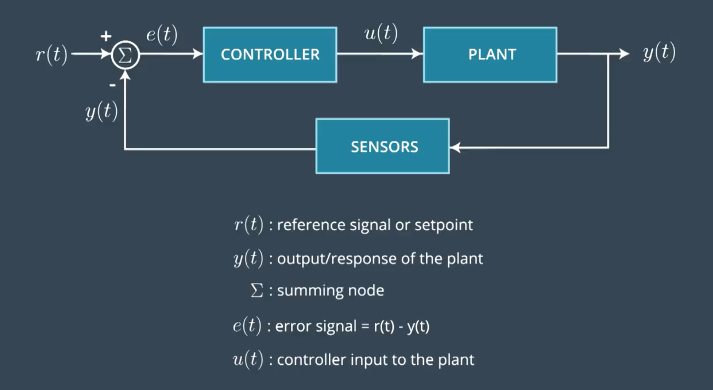 

 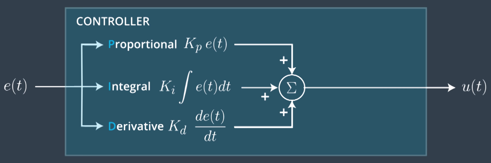 

 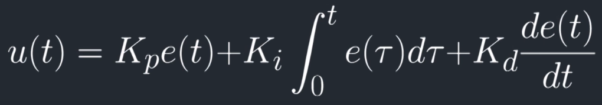 

 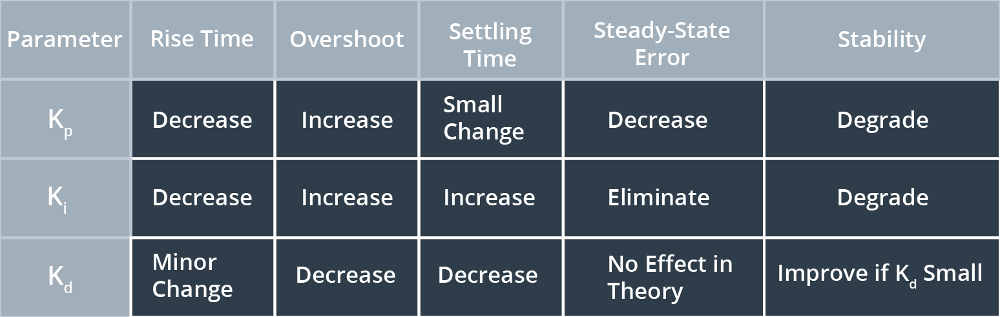 

# Open Controller

 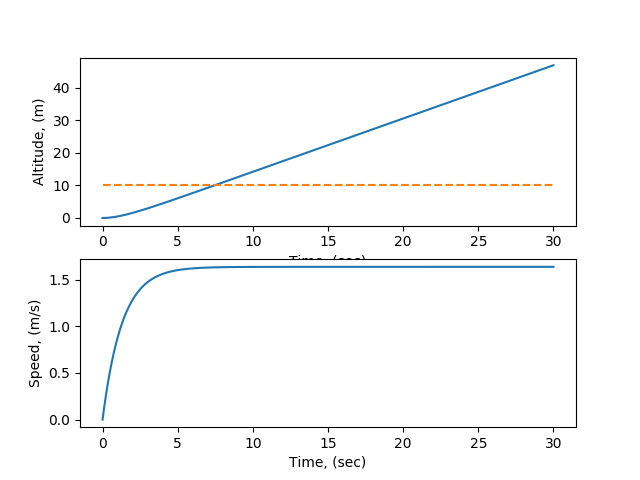 

 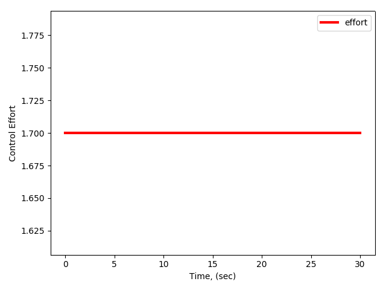 

The rise time is 7.455 seconds

The percent overshoot is 369.7%

The offset from the target at 30 seconds is 36.974 meters

# P Controller

 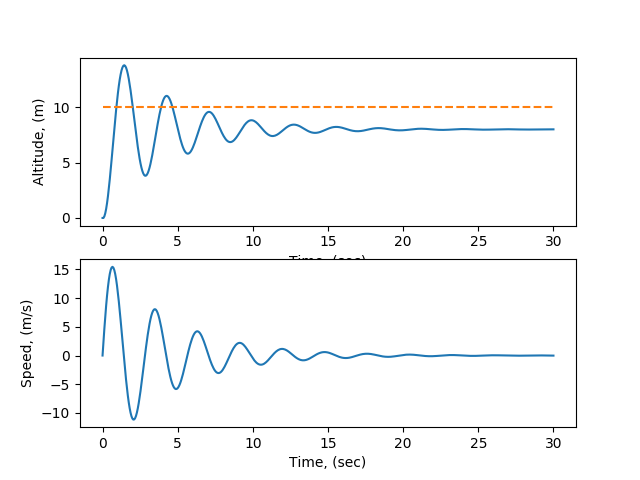 

 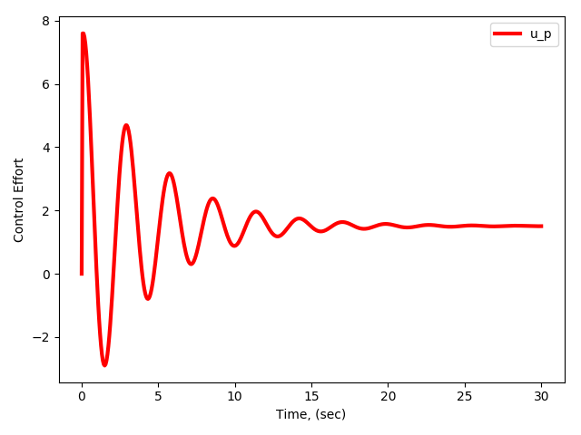 

The rise time is 0.962 seconds

The percent overshoot is 38.2%

The steady state offset at 30 seconds is 1.981 meters

# PI Controller

 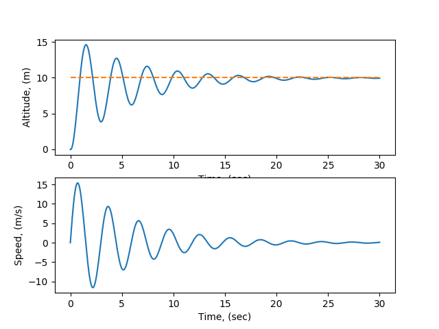 

 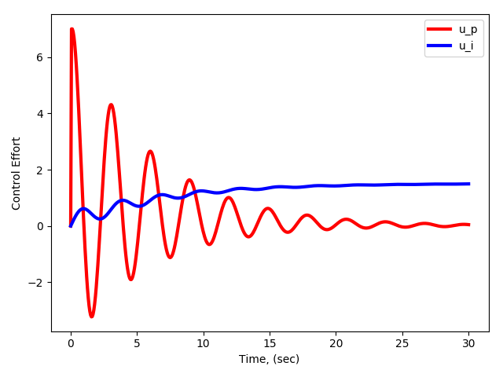 

The rise time is 0.962 seconds

The percent overshoot is 46.1%

The steady state offset at 30 seconds is 0.061 meters

# PD Controller

 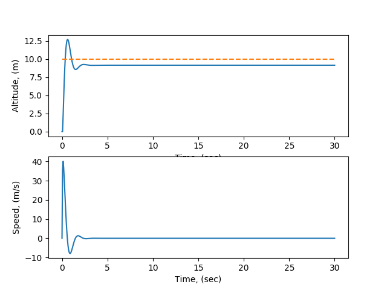 

 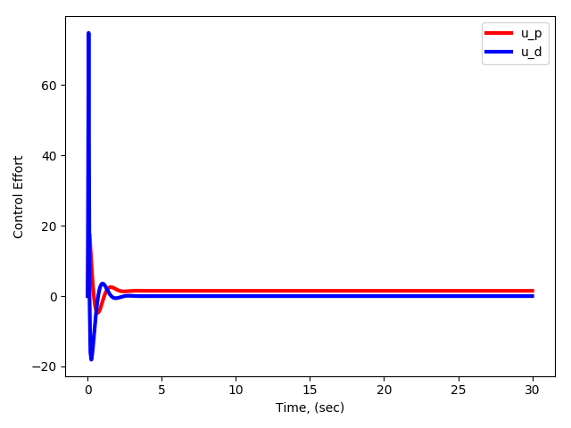 

The rise time is 0.361 seconds

The percent overshoot is 26.9%

The steady state offset at 30 seconds is 0.858 meters

# PID Controller

 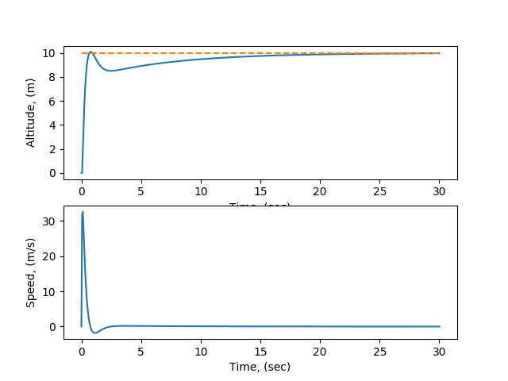 

 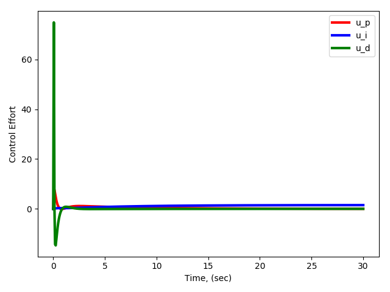 

The rise time is 0.721 seconds

The percent overshoot is 1.0%

The steady state offset at 30 seconds is 0.028 meters

# Filter

 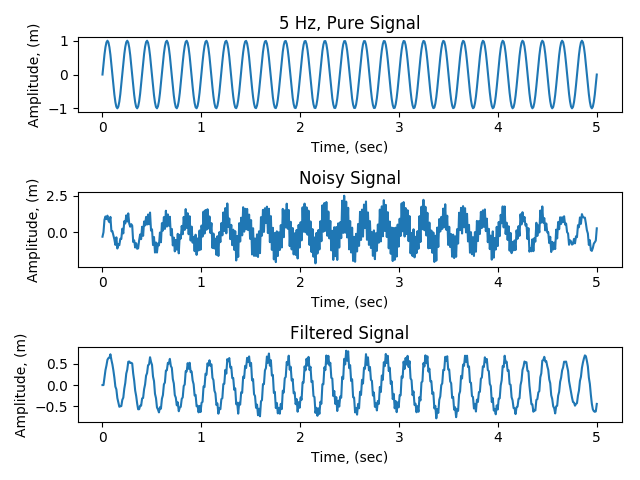 

